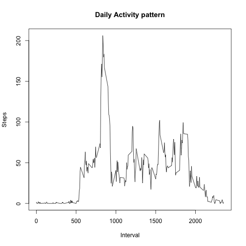

# Analysis of Activity Monitoring Data

## Loading and preprocessing the data

Load the data (i.e. read.csv())

```r
activity <- read.csv("activity.csv")
```

## What is mean total number of steps taken per day?

To compute the mean total number of steps taken per day, we aggregate the data frame by day using the sum function on steps column.

We then plot a histogram of total steps taken each day.


```r
activity_by_day <- aggregate(steps ~ date, activity, sum,na.rm = TRUE)
hist(activity_by_day$steps,breaks=22, main="Histogram of total steps per day",
     ylab="Frequency",xlab="Steps per day")
```

 

### Mean of total steps per day:

```r
mean(activity_by_day$steps)
```

```
## [1] 10766.19
```

### Median of total steps per day:

```r
median(activity_by_day$steps)
```

```
## [1] 10765
```

## What is the average daily activity pattern?

Let us aggregate the data for each 5 minute interval averaging the data for each day

```r
activity_by_interval <- aggregate(steps ~ interval, activity, mean, na.rm=TRUE)
```

### Make a time series plot

Make a time series plot (i.e. type = "l") of the 5-minute interval (x-axis) and the average number of steps taken, averaged across all days (y-axis)


```r
plot(activity_by_interval$interval,activity_by_interval$steps,type="l", 
     main="Daily Activity pattern",xlab="Interval",ylab="Steps")
```

 

### Which 5-minute interval, on average across all the days in the dataset, contains the maximum number of steps?


```r
activity_by_interval[which.max(activity_by_interval[,2]),]
```

```
##     interval    steps
## 104      835 206.1698
```

## Imputing missing values

### report the total number of missing values
Calculate and report the total number of missing values in the dataset (i.e. the total number of rows with NAs)

```r
length(which(is.na(activity$steps)))
```

```
## [1] 2304
```

Impute the missing values by replacing NAs with the average value for that interval across all days


```r
# We first create a copy of the activity data frame into activity2
activity2 <- activity

#Replace the missing values with the average for that interval from activity_by_interval
activity2[is.na(activity$steps),1] <- round(activity_by_interval[,2])
```

Let us compute mean total number of steps taken per day for the new data with imputed values

We then plot a histogram of total steps taken each day.


```r
activity2_by_day <- aggregate(steps ~ date, activity2, sum)
hist(activity2_by_day$steps,breaks=22, main="Histogram of total steps per day",
     ylab="Frequency",xlab="Steps per day")
```

 

### Mean of total steps per day:

```r
mean(activity2_by_day$steps)
```

```
## [1] 10765.64
```
Compute the difference between the mean without imputed values and with imputed values. They are very close

```r
mean(activity2_by_day$steps) - mean(activity_by_day$steps)
```

```
## [1] -0.549335
```

### Median of total steps per day:

```r
median(activity2_by_day$steps)
```

```
## [1] 10762
```
Compute the difference between the median without imputed values and with imputed values. They are very close

```r
median(activity2_by_day$steps) - median(activity_by_day$steps)
```

```
## [1] -3
```

## Are there differences in activity patterns between weekdays and weekends?

Add a factor column indicating if it is a weekday or weekend. Recompute the average steps for each interval for weekdays and weekends


```r
activity2$day <- factor(weekdays(as.POSIXlt(activity2$date)) %in% c("Saturday","Sunday"),
                        c("FALSE","TRUE"),c("Weekday","Weekend"))
activity2_by_interval_weekdays <- aggregate(steps ~ interval, activity2[activity2$day == "Weekday",], mean)
activity2_by_interval_weekdays$day = c("Weekday")
activity2_by_interval_weekends <- aggregate(steps ~ interval, activity2[activity2$day == "Weekend",], mean)
activity2_by_interval_weekends$day = c("Weekend")
activity2_by_interval <- rbind(activity2_by_interval_weekdays,activity2_by_interval_weekends)
```

### Make a time series plot

Make a time series plot (i.e. type = "l") of the 5-minute interval (x-axis) and the average number of steps taken, averaged across weekdays and weekends (y-axis)


```r
library(lattice)
xyplot(steps ~ interval | day, activity2_by_interval, layout=c(1,2), type="l")
```

 

